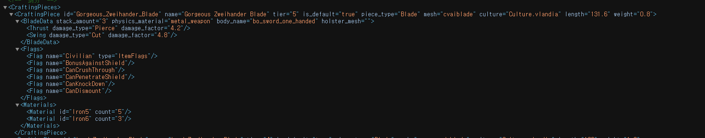

# 사용법
  
The threshold has been lowered, and the attack direction restrictions have been removed.  
  
1. Copy `SandBox.dll` to `/Modules/SandBox/bin/`.  
2. Before copying, back up the original `SandBox.dll` file.  
3. Then open the desired weapon's `.xml` file and add `CanCrushThrough`.  

# Reference  
The .dll file was modified in IL using dnSpy.

dnspy IL

dnspy c# 

